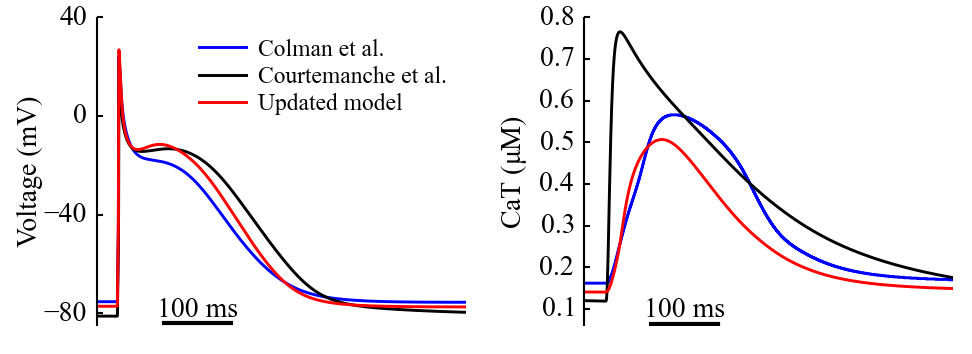

# Source code for Ni_etal_2017_Front_Physiol

H Ni, DG Whittaker, W Wang, WR Giles, SM Narayan, H Zhang. Synergistic anti-arrhythmic effects in human atria with combined use of sodium blockers and acacetin. Frontiers in physiology 8, 946




* Run the code with: 
./Optimise_main_Drug_Updated_CNZ 1000 14 1000 WT Normal 0 0 0 0 0 0

* Command
``` C++
	BCL               = atof(argv[1]);
	int celltype      = atof(argv[2]);
	double S2         = atof(argv[3]);
	std::string Mut   = (argv[4]);
	std::string Mode  = (argv[5]);
  
	double IKur_Drug_con = atof(argv[6]);
  	int AF = atoi(argv[7]);
	cell_para.drug_INa_concen = 0.0;
	cell_para.SetAcacetinEffectPara(IKur_Drug_con); // 3.2 um of acacetin

	 // Kon koff for IKur inhibitor
	double Ka = atof(argv[8]);
	double Ki = atof(argv[9]);
	double La = atof(argv[10]);
	double Li = atof(argv[11]);


```
